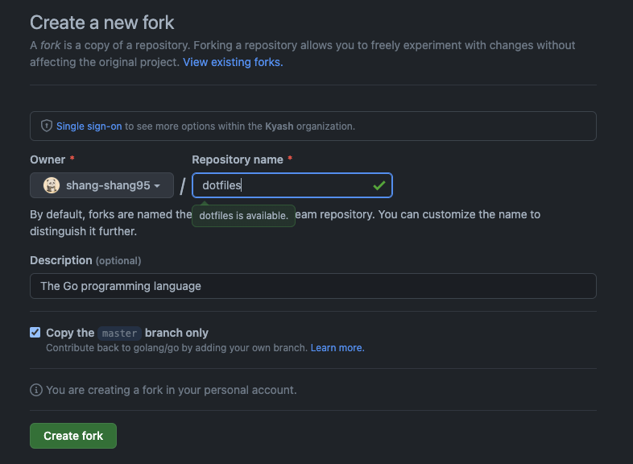
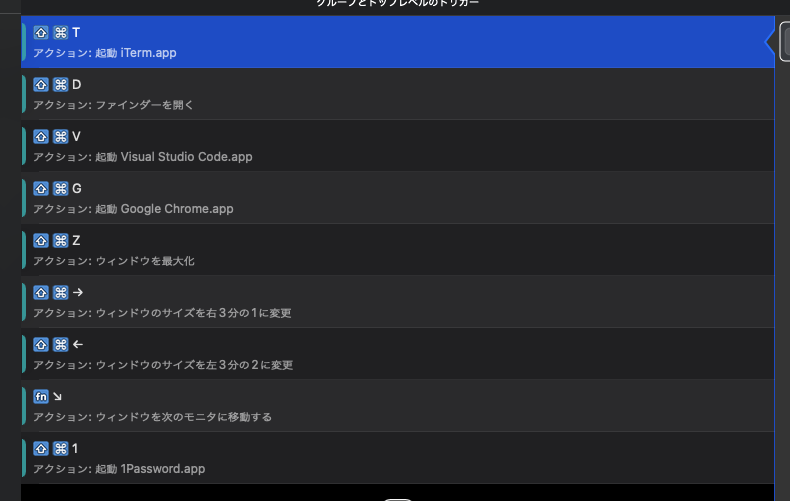

# セットアップ

1. Safariで[このページ](https://qiita.com/shizuma/items/2b2f873a0034839e47ce)を開き、SSH接続を設定する。
    - なお、この時点でGoogle Chromeをインストールすると、後でHomebrewで「brew bundle」を実行したときに失敗することがあります。

2. このリポジトリをフォークします。
    

3. Gitの作者設定を行います。
    ```
    $ git config --global user.name "shang-shang95"
    $ git config --global user.email xxx@xxx.com
    ```

4. `./HomeBrew/install.sh`を実行します。
    - Homebrewを使って必要最低限のソフトをインストールします。何がインストールされるかは、`Brewfile`を参照してください。

5. `./link.sh` を実行します。
    - 設定ファイルへのシンボリックリンクを作成します。

6. BTT、iTerm2を起動し、設定ファイルを手動でインポートします。

# 設定詳細
この設定ファイルで何を設定しているか。
大まかな紹介なので詳細な部分は最新の設定に準じていないかも。

## BetterTouchTool(BTT)
よく使うアプリやウィンドウ操作をショートカットキーに割当て。

※ GoogleChromeを開いているときのショートカットキーと重なる場合は、Chrome拡張機能で無効にしてください。



## Karabiner
- CapsLockキーをCtrlキーに変更
- コマンドキーを単体で押すと、かな/英を切り替える。
- コロン(:)とセミコロン(;)を入れ替える。

## VisualStudioCode
- カーソル移動や単語単位での選択のキーバインド

## iTerm2
- ウィンドウの色や透過率、ショートカットキーの設定。