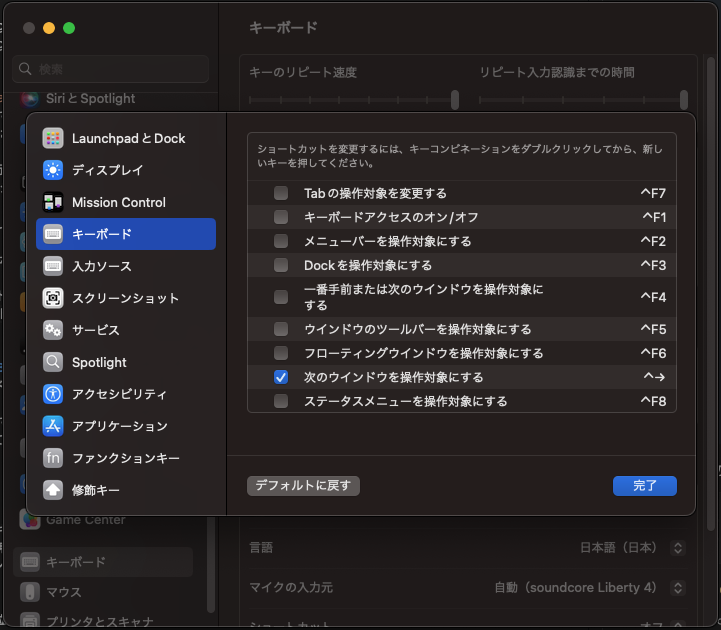

# セットアップ
**プリインストールされているSafariでChromeをインストールしている前提**

1. Chromeで[このページ](https://qiita.com/shizuma/items/2b2f873a0034839e47ce)を開き、SSH接続を設定する

2. このリポジトリをフォークする
    

3. Gitの作者設定を行う
    ```
    $ git config --global user.name "shang-shang95"
    $ git config --global user.email xxx@xxx.com
    ```

4. `./HomeBrew/install.sh`を実行
    - Homebrewを使って必要最低限のソフトをインストール
    - 何がインストールされるかは、`Brewfile`を参照

5. `./link.sh` を実行
    - 設定ファイルへのシンボリックリンクを作成

6. BTT、iTerm2を起動し、ライセンスと設定ファイルを手動でインポート

7. システム設定 > キーボード > キーボードショートカット > キーボード > 次のウィンドウを操作対象にするを選択  
    `ctrl+→`をショートカットキーに登録  
    この時、他のショートカットキーに既に該当の組み合わせがあると競合するので、あれば適当に変えておく  
    これで同アプリケーションのウィンドウ切り替えができる  
    

# 設定詳細
## BetterTouchTool(BTT)
よく使うアプリやウィンドウ操作をショートカットキーに割当て  
※ GoogleChromeを開いているときのショートカットキーと重なる場合は、Chrome拡張機能でChrome側のショートカットキーを無効にしてください  


## Karabiner
- CapsLockキーをCtrlキーに変更
- コマンドキーを単体で押すと、かな/英を切り替え
- コロン(:)とセミコロン(;)を入れ替え

## VisualStudioCode
- カーソル移動や単語単位での選択のキーバインド

## iTerm2
- ウィンドウの色や透過率、ショートカットキーの設定